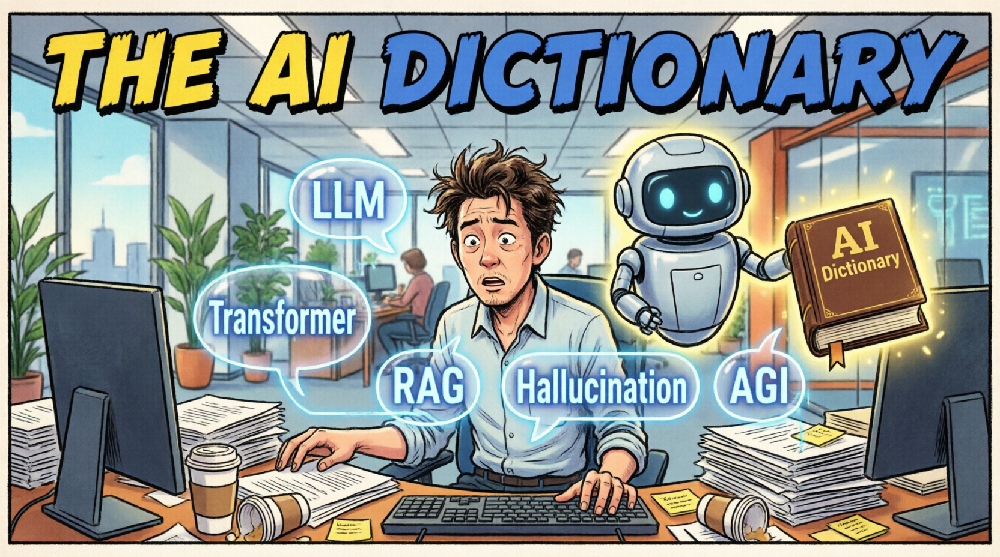

  

---

A curated, living dictionary of artificial intelligence and machine learning terminology.  
Built for **everyone** — from complete beginners to seasoned practitioners.

> **Created and curated by [Alex Nubla](https://www.linkedin.com/in/alexnubla/).**

> **💡 Goal:** To promote AI literacy by providing clear, accessible explanations of complex AI concepts.  
> Every term includes a **"Simple Version"** written in plain English — no jargon, no assumptions — so anyone can understand, regardless of their technical background.

> **🎯 Scope & Rigor:** We strictly exclude "confabulations," marketing fluff, or made-up buzzwords that lack real currency in standard AI terminology. This dictionary focuses exclusively on validated, widely recognized concepts with established technical definitions.

  
  
  
  

---

## 📂 Browse by Category

<strong>🏗️ Architecture</strong> — 42 terms · Core model designs, neural network structures, and foundational paradigms

<a href="./terms/activation-function/">Activation Function</a> · <a href="./terms/agi/">AGI (Artificial General Intelligence)</a> · <a href="./terms/algorithm/">Algorithm</a> · <a href="./terms/artificial-intelligence/">Artificial Intelligence (AI)</a> · <a href="./terms/attention-mechanism/">Attention Mechanism</a> · <a href="./terms/autoregressive/">Autoregressive</a> · <a href="./terms/bert/">BERT</a> · <a href="./terms/cnn/">CNN</a> · <a href="./terms/computer-vision/">Computer Vision</a> · <a href="./terms/context-window/">Context Window</a> · <a href="./terms/deep-learning/">Deep Learning</a> · <a href="./terms/diffusion-model/">Diffusion Model</a> · <a href="./terms/embedding/">Embedding</a> · <a href="./terms/encoder-decoder/">Encoder-Decoder</a> · <a href="./terms/expert-systems/">Expert Systems</a> · <a href="./terms/foundation-model/">Foundation Model</a> · <a href="./terms/gan/">GAN</a> · <a href="./terms/generative-ai/">Generative AI</a> · <a href="./terms/gpt/">GPT</a> · <a href="./terms/gru/">GRU</a> · <a href="./terms/llm/">LLM</a> · <a href="./terms/lrm/">LRM</a> · <a href="./terms/lstm/">LSTM</a> · <a href="./terms/machine-learning/">Machine Learning (ML)</a> · <a href="./terms/moe/">Mixture of Experts (MoE)</a> · <a href="./terms/model/">Model</a> · <a href="./terms/multimodal/">Multimodal</a> · <a href="./terms/narrow-ai/">Narrow AI</a> · <a href="./terms/nlp/">Natural Language Processing (NLP)</a> · <a href="./terms/neural-network/">Neural Network</a> · <a href="./terms/object-detection/">Object Detection</a> · <a href="./terms/open-weight-model/">Open-Weight Model</a> · <a href="./terms/parameter/">Parameter</a> · <a href="./terms/rnn/">RNN</a> · <a href="./terms/reasoning-model/">Reasoning Model</a> · <a href="./terms/robotics/">Robotics</a> · <a href="./terms/spatial-intelligence/">Spatial Intelligence</a> · <a href="./terms/token/">Token</a> · <a href="./terms/transformer/">Transformer</a> · <a href="./terms/weights/">Weights</a> · <a href="./terms/xgboost/">XGBoost</a> · <a href="./terms/yolo/">YOLO</a>

<strong>⚙️ Training</strong> — 33 terms · How models learn, adapt, and improve

<a href="./terms/backpropagation/">Backpropagation</a> · <a href="./terms/catastrophic-forgetting/">Catastrophic Forgetting</a> · <a href="./terms/chain-of-thought/">Chain of Thought</a> · <a href="./terms/context-engineering/">Context Engineering</a> · <a href="./terms/data-augmentation/">Data Augmentation</a> · <a href="./terms/distillation/">Distillation</a> · <a href="./terms/dpo/">DPO</a> · <a href="./terms/federated-learning/">Federated Learning</a> · <a href="./terms/few-shot-learning/">Few-Shot Learning</a> · <a href="./terms/fine-tuning/">Fine-tuning</a> · <a href="./terms/gradient-descent/">Gradient Descent</a> · <a href="./terms/hyperparameter/">Hyperparameter</a> · <a href="./terms/in-context-learning/">In-Context Learning</a> · <a href="./terms/learning-rate/">Learning Rate</a> · <a href="./terms/lora/">LoRA</a> · <a href="./terms/loss-function/">Loss Function</a> · <a href="./terms/optimizer/">Optimizer</a> · <a href="./terms/overfitting-underfitting/">Overfitting / Underfitting</a> · <a href="./terms/peft/">PEFT</a> · <a href="./terms/pre-training/">Pre-training</a> · <a href="./terms/prompt/">Prompt</a> · <a href="./terms/prompt-engineering/">Prompt Engineering</a> · <a href="./terms/reinforcement-learning/">Reinforcement Learning (RL)</a> · <a href="./terms/reward-model/">Reward Model</a> · <a href="./terms/rlhf/">RLHF</a> · <a href="./terms/scaling-laws/">Scaling Laws</a> · <a href="./terms/self-supervised-learning/">Self-Supervised Learning</a> · <a href="./terms/supervised-learning/">Supervised Learning</a> · <a href="./terms/synthetic-data/">Synthetic Data</a> · <a href="./terms/training/">Training</a> · <a href="./terms/transfer-learning/">Transfer Learning</a> · <a href="./terms/unsupervised-learning/">Unsupervised Learning</a> · <a href="./terms/zero-shot-learning/">Zero-Shot Learning</a>

<strong>🚀 Deployment</strong> — 24 terms · Putting models into production

<a href="./terms/batch-processing/">Batch Processing</a> · <a href="./terms/caching/">Caching</a> · <a href="./terms/edge-computing/">Edge Computing</a> · <a href="./terms/feature-store/">Feature Store</a> · <a href="./terms/graphics-processing-unit/">Graphics Processing Unit (GPU)</a> · <a href="./terms/grounding/">Grounding</a> · <a href="./terms/inference/">Inference</a> · <a href="./terms/inference-time-compute/">Inference-Time Compute</a> · <a href="./terms/kv-cache/">KV Cache</a> · <a href="./terms/latency/">Latency</a> · <a href="./terms/mcp/">MCP</a> · <a href="./terms/model-serving/">Model Serving</a> · <a href="./terms/observability/">Observability</a> · <a href="./terms/orchestration/">Orchestration</a> · <a href="./terms/prompt-injection/">Prompt Injection</a> · <a href="./terms/quantization/">Quantization</a> · <a href="./terms/rag/">RAG</a> · <a href="./terms/sampling/">Sampling</a> · <a href="./terms/semantic-search/">Semantic Search</a> · <a href="./terms/speculative-decoding/">Speculative Decoding</a> · <a href="./terms/streaming/">Streaming</a> · <a href="./terms/temperature/">Temperature</a> · <a href="./terms/throughput/">Throughput</a> · <a href="./terms/vector-database/">Vector Database</a>

<strong>📏 Evaluation</strong> — 5 terms · Measuring model performance and quality

<a href="./terms/benchmarking/">Benchmarking</a> · <a href="./terms/deterministic/">Deterministic</a> · <a href="./terms/hallucination/">Hallucination</a> · <a href="./terms/non-deterministic/">Non-Deterministic</a> · <a href="./terms/perplexity/">Perplexity</a>

<strong>🛡️ Ethics &amp; Safety</strong> — 16 terms · Responsible AI and risk mitigation

<a href="./terms/ai-safety/">AI Safety</a> · <a href="./terms/ai-slop/">AI Slop</a> · <a href="./terms/ai-washing/">AI Washing</a> · <a href="./terms/alignment/">Alignment</a> · <a href="./terms/bias/">Bias</a> · <a href="./terms/data-privacy/">Data Privacy</a> · <a href="./terms/deepfake/">Deepfake</a> · <a href="./terms/ethical-ai/">Ethical AI</a> · <a href="./terms/explainability/">Explainability / XAI</a> · <a href="./terms/guardrails/">Guardrails</a> · <a href="./terms/hitl/">HITL</a> · <a href="./terms/human-centered-ai/">Human-Centered AI (HCAI)</a> · <a href="./terms/jailbreak/">Jailbreak</a> · <a href="./terms/parasitic-ai/">Parasitic AI</a> · <a href="./terms/responsible-ai/">Responsible AI</a> · <a href="./terms/spiralism/">Spiralism</a>

<strong>🏢 Enterprise AI</strong> — 14 terms · AI infrastructure, governance, and organizational adoption

<a href="./terms/agent/">Agent</a> · <a href="./terms/agentic-ai/">Agentic AI</a> · <a href="./terms/ai-gateway/">AI Gateway</a> · <a href="./terms/chatbot/">Chatbot</a> · <a href="./terms/compliance/">Compliance</a> · <a href="./terms/conversational-ai/">Conversational AI</a> · <a href="./terms/copilot/">Copilot</a> · <a href="./terms/mlops/">MLOps / LLMOps</a> · <a href="./terms/model-monitoring/">Model Monitoring / Drift Detection</a> · <a href="./terms/open-source/">Open Source</a> · <a href="./terms/predictive-analytics/">Predictive Analytics</a> · <a href="./terms/shadow-ai/">Shadow AI</a> · <a href="./terms/tool-use/">Tool Use / Function Calling</a> · <a href="./terms/vibe-coding/">Vibe Coding</a>

<strong>🏥 Healthcare AI</strong> — 15 terms · AI applications, standards, and regulations in healthcare delivery and clinical care

<a href="./terms/clinical-decision-support/">Clinical Decision Support (CDS)</a> · <a href="./terms/clinical-nlp/">Clinical NLP</a> · <a href="./terms/clinical-trials-ai/">Clinical Trials AI</a> · <a href="./terms/diagnostic-ai/">Diagnostic AI</a> · <a href="./terms/dicom/">DICOM</a> · <a href="./terms/ehr-integration/">EHR Integration</a> · <a href="./terms/fda-approval-samd/">FDA Approval (SaMD)</a> · <a href="./terms/fhir/">FHIR</a> · <a href="./terms/health-informatics/">Health Informatics</a> · <a href="./terms/interoperability/">Interoperability</a> · <a href="./terms/medical-imaging-ai/">Medical Imaging AI</a> · <a href="./terms/phi/">PHI</a> · <a href="./terms/precision-medicine/">Precision Medicine</a> · <a href="./terms/remote-patient-monitoring/">Remote Patient Monitoring (RPM)</a> · <a href="./terms/regulatory-ai/">Regulatory AI</a>

---

## 🔤 Browse All Terms (A-Z)

| Letter | Terms |
| :---: | :--- |
| **A** | [Activation Function](./terms/activation-function/), [Agent](./terms/agent/), [Agentic AI](./terms/agentic-ai/), [AGI (Artificial General Intelligence)](./terms/agi/), [AI Gateway](./terms/ai-gateway/), [AI Safety](./terms/ai-safety/), [AI Slop](./terms/ai-slop/), [AI Washing](./terms/ai-washing/), [Algorithm](./terms/algorithm/), [Alignment](./terms/alignment/), [Artificial Intelligence (AI)](./terms/artificial-intelligence/), [Attention Mechanism](./terms/attention-mechanism/), [Autoregressive](./terms/autoregressive/) |
| **B** | [Backpropagation](./terms/backpropagation/), [Batch Processing](./terms/batch-processing/), [Benchmarking](./terms/benchmarking/), [BERT](./terms/bert/), [Bias](./terms/bias/) |
| **C** | [Caching](./terms/caching/), [Catastrophic Forgetting](./terms/catastrophic-forgetting/), [Chain of Thought](./terms/chain-of-thought/), [Chatbot](./terms/chatbot/), [Clinical Decision Support (CDS)](./terms/clinical-decision-support/), [Clinical NLP](./terms/clinical-nlp/), [Clinical Trials AI](./terms/clinical-trials-ai/), [CNN](./terms/cnn/), [Compliance](./terms/compliance/), [Computer Vision](./terms/computer-vision/), [Context Engineering](./terms/context-engineering/), [Context Window](./terms/context-window/), [Conversational AI](./terms/conversational-ai/), [Copilot](./terms/copilot/) |
| **D** | [Data Augmentation](./terms/data-augmentation/), [Data Privacy](./terms/data-privacy/), [Deep Learning](./terms/deep-learning/), [Deepfake](./terms/deepfake/), [Deterministic](./terms/deterministic/), [Diagnostic AI](./terms/diagnostic-ai/), [DICOM](./terms/dicom/), [Diffusion Model](./terms/diffusion-model/), [Distillation](./terms/distillation/), [DPO](./terms/dpo/) |
| **E** | [Edge Computing](./terms/edge-computing/), [Embedding](./terms/embedding/), [Encoder-Decoder](./terms/encoder-decoder/), [EHR Integration](./terms/ehr-integration/), [Ethical AI](./terms/ethical-ai/), [Explainability / XAI](./terms/explainability/) |
| **F** | [FDA Approval (SaMD)](./terms/fda-approval-samd/), [Federated Learning](./terms/federated-learning/), [Feature Store](./terms/feature-store/), [Few-Shot Learning](./terms/few-shot-learning/), [FHIR (Fast Healthcare Interoperability Resources)](./terms/fhir/), [Fine-tuning](./terms/fine-tuning/), [Foundation Model](./terms/foundation-model/) |
| **G** | [GAN](./terms/gan/), [Generative AI](./terms/generative-ai/), [GPT](./terms/gpt/), [Gradient Descent](./terms/gradient-descent/), [Graphics Processing Unit (GPU)](./terms/gpu/), [Grounding](./terms/grounding/), [GRU](./terms/gru/), [Guardrails](./terms/guardrails/) |
| **H** | [Hallucination](./terms/hallucination/), [Health Informatics](./terms/health-informatics/), [HITL](./terms/hitl/), [Human-Centered AI (HCAI)](./terms/human-centered-ai/), [Hyperparameter](./terms/hyperparameter/) |
| **I** | [In-Context Learning](./terms/in-context-learning/), [Inference](./terms/inference/), [Inference-Time Compute](./terms/inference-time-compute/), [Interoperability](./terms/interoperability/) |
| **J** | [Jailbreak](./terms/jailbreak/) |
| **K** | [KV Cache](./terms/kv-cache/) |
| **L** | [Latency](./terms/latency/), [Learning Rate](./terms/learning-rate/), [LLM](./terms/llm/), [LoRA](./terms/lora/), [Loss Function](./terms/loss-function/), [LRM](./terms/lrm/), [LSTM](./terms/lstm/) |
| **M** | [Machine Learning (ML)](./terms/machine-learning/), [MCP](./terms/mcp/), [Medical Imaging AI](./terms/medical-imaging-ai/), [Mixture of Experts (MoE)](./terms/moe/), [MLOps / LLMOps](./terms/mlops/), [Model](./terms/model/), [Model Monitoring / Drift Detection](./terms/model-monitoring/), [Model Serving](./terms/model-serving/), [Multimodal](./terms/multimodal/) |
| **N** | [Narrow AI](./terms/narrow-ai/), [Natural Language Processing (NLP)](./terms/nlp/), [Neural Network](./terms/neural-network/), [Non-Deterministic](./terms/non-deterministic/) |
| **O** | [Object Detection](./terms/object-detection/), [Observability](./terms/observability/), [Open Source](./terms/open-source/), [Open-Weight Model](./terms/open-weight-model/), [Optimizer](./terms/optimizer/), [Orchestration](./terms/orchestration/), [Overfitting / Underfitting](./terms/overfitting-underfitting/) |
| **P** | [Parameter](./terms/parameter/), [Parasitic AI](./terms/parasitic-ai/), [PEFT](./terms/peft/), [Perplexity](./terms/perplexity/), [PHI (Protected Health Information)](./terms/phi/), [Precision Medicine](./terms/precision-medicine/), [Predictive Analytics](./terms/predictive-analytics/), [Pre-training](./terms/pre-training/), [Prompt](./terms/prompt/), [Prompt Engineering](./terms/prompt-engineering/), [Prompt Injection](./terms/prompt-injection/) |
| **Q** | [Quantization](./terms/quantization/) |
| **R** | [RAG](./terms/rag/), [Reasoning Model](./terms/reasoning-model/), [Regulatory AI](./terms/regulatory-ai/), [Reinforcement Learning (RL)](./terms/reinforcement-learning/), [Remote Patient Monitoring (RPM)](./terms/remote-patient-monitoring/), [Responsible AI](./terms/responsible-ai/), [Reward Model](./terms/reward-model/), [RLHF](./terms/rlhf/), [RNN](./terms/rnn/), [Robotics](./terms/robotics/) |
| **S** | [Sampling](./terms/sampling/), [Scaling Laws](./terms/scaling-laws/), [Semantic Search](./terms/semantic-search/), [Self-Supervised Learning](./terms/self-supervised-learning/), [Shadow AI](./terms/shadow-ai/), [Spatial Intelligence](./terms/spatial-intelligence/), [Speculative Decoding](./terms/speculative-decoding/), [Spiralism](./terms/spiralism/), [Streaming](./terms/streaming/), [Supervised Learning](./terms/supervised-learning/), [Synthetic Data](./terms/synthetic-data/) |
| **T** | [Temperature](./terms/temperature/), [Throughput](./terms/throughput/), [Token](./terms/token/), [Tool Use / Function Calling](./terms/tool-use/), [Training](./terms/training/), [Transfer Learning](./terms/transfer-learning/), [Transformer](./terms/transformer/) |
| **U** | [Unsupervised Learning](./terms/unsupervised-learning/) |
| **V** | [Vector Database](./terms/vector-database/), [Vibe Coding](./terms/vibe-coding/) |
| **W** | [Weights](./terms/weights/) |
| **X** | [XGBoost](./terms/xgboost/) |
| **Y** | [YOLO](./terms/yolo/) |
| **Z** | [Zero-Shot Learning](./terms/zero-shot-learning/) |

🔍 **[Search the Dictionary](/ai-dictionary/search.html)** | 📚 **[View All Terms](/ai-dictionary/terms/)**

---

### 🤝 Contributing & License
Want to add a term? Check out our [Contributing Guidelines](CONTRIBUTING.md). 
This project is open source under the [MIT License](LICENSE).
