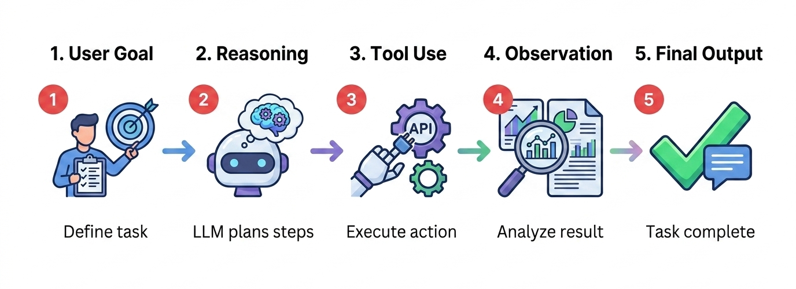

# Agent

An autonomous AI entity that combines a language model with the ability to perceive its environment, reason about goals, plan actions, use tools, and execute multi-step tasks with minimal human intervention — the fundamental building block of agentic AI systems.

## The Simple Version
If an LLM is a very smart brain in a jar, an Agent is that brain given a body, hands, and a to-do list. It can look at its surroundings (perceive), think about what to do (reason), grab tools to accomplish tasks (act), and check whether it succeeded (evaluate). 

A chatbot waits for you to ask a question and gives one answer. An Agent is given a goal ("Book me a flight to London under $1,000") and figures out all the steps on its own: search flights, compare prices, check your calendar, book the best option, and add it to your itinerary.

## Visual Workflow



## Detailed Explanation
An Agent is the concrete instantiation of agentic AI principles. While "Agentic AI" describes the paradigm, an "Agent" is the actual system doing the work.

**Core Components of an Agent:**
1. **Brain (LLM):** The reasoning engine that processes information and makes decisions
2. **Memory:** 
   - *Short-term:* Current task context and conversation history
   - *Long-term:* Persistent knowledge about the user, past tasks, and learned patterns
3. **Tools:** External capabilities the agent can invoke (search, APIs, databases, code execution)
4. **Planning Module:** Ability to break goals into subtasks and sequence actions
5. **Action Loop:** Perceive → Think → Act → Observe → Repeat

**Agent Architectures:**

**ReAct (Reasoning + Acting):**
The agent alternates between reasoning about what to do and taking actions.
```
Thought: I need to find the current stock price of AAPL
Action: search_web("AAPL stock price today")
Observation: AAPL is trading at $195.50
Thought: Now I can answer the user's question
Action: respond("AAPL is currently at $195.50")
```

**Plan-and-Execute:**
The agent creates a complete plan upfront, then executes each step.
```
Plan: 
1. Search for flights to London
2. Filter by price < $1000
3. Check user's calendar for availability
4. Book the best option
5. Add to calendar
Execute step 1... Execute step 2... etc.
```

**Multi-Agent Systems:**
Multiple specialized agents collaborate on complex tasks.
- *Researcher Agent:* Gathers information
- *Analyst Agent:* Processes and interprets data
- *Writer Agent:* Drafts the final report
- *Reviewer Agent:* Checks quality and accuracy

**Popular Agent Frameworks:**
- **LangGraph:** Stateful, graph-based agent orchestration
- **AutoGen:** Multi-agent conversation framework
- **CrewAI:** Role-based agent teams
- **OpenAI Agents SDK:** Official agent building toolkit
- **Anthropic's Computer Use:** Agents that can operate computers

## Key Characteristics
- **Autonomy:** Operates with minimal human oversight once given a goal
- **Goal-Oriented:** Driven by outcomes, not just single-turn responses
- **Tool-Using:** Can invoke external APIs, databases, and services
- **Iterative:** Can loop, self-correct, and retry failed actions
- **Stateful:** Maintains context and memory across steps and time

## Business Context
Agents represent the next evolution of enterprise AI, moving from "AI as a tool" to "AI as a worker":

**Enterprise Applications:**
- **Software Development:** Agents that write code, run tests, debug, and submit PRs
- **Customer Operations:** Agents that handle entire support tickets end-to-end
- **Data Analysis:** Agents that query databases, analyze results, and generate reports
- **Research:** Agents that gather information, synthesize findings, and produce briefings
- **IT Operations:** Agents that monitor systems, diagnose issues, and execute fixes

**Strategic Considerations:**
- **Human Oversight:** Most production agents require human-in-the-loop approval for critical actions
- **Security:** Agents need strict permission boundaries — what can they access and modify?
- **Cost Management:** Multi-step agent workflows can consume significant tokens
- **Reliability:** Agents can get stuck in loops or make incorrect tool calls; robust error handling is essential
- **Auditability:** Every agent action should be logged for compliance and debugging

**Agent vs. Chatbot:**
| Aspect | Chatbot | Agent |
|--------|---------|-------|
| **Interaction** | Single turn or conversation | Multi-step task execution |
| **Control** | User drives every step | Agent drives toward goal |
| **Tools** | Limited or none | Multiple external tools |
| **Memory** | Conversation context | Task + long-term memory |
| **Autonomy** | Low | High |

## Real-World Analogy
A personal assistant vs. a search engine. A search engine (chatbot) answers your questions. A personal assistant (agent) takes your goal ("Plan my vacation") and handles everything: researches destinations, checks your budget, books flights and hotels, creates an itinerary, and sets reminders. You just approve the final plan.

## Code Example

```python
# Simple agent using OpenAI's Agents SDK (conceptual)
from agents import Agent, Runner, function_tool

# Define tools the agent can use
@function_tool
def search_flights(destination: str, max_price: int) -> str:
    """Search for flights under a given price."""
    # In reality, this would call a flight API
    return f"Found 3 flights to {destination} under ${max_price}"

@function_tool
def book_flight(flight_id: str) -> str:
    """Book a specific flight."""
    return f"Flight {flight_id} booked successfully"

# Create the agent
travel_agent = Agent(
    name="Travel Assistant",
    instructions="You help users book flights. Always confirm details before booking.",
    tools=[search_flights, book_flight]
)

# Run the agent with a goal
result = Runner.run_sync(
    travel_agent,
    "Book me a flight to Tokyo under $1500 for next month"
)

print("Agent completed task:", result.final_output)
# The agent will:
# 1. Search for flights to Tokyo under $1500
# 2. Present options to user
# 3. Wait for confirmation
# 4. Book the selected flight
# 5. Return confirmation
```

## Common Misconceptions
- **Myth:** Agents are fully autonomous and don't need humans.
- **Reality:** Most production agents require human oversight, especially for actions that modify external systems (sending emails, making purchases, deleting data). "Human-in-the-loop" is critical for safety.

- **Myth:** Any LLM can be an agent.
- **Reality:** While LLMs provide the reasoning, true agents require orchestration frameworks to manage state, tools, memory, and error handling. The LLM is just one component.

- **Myth:** Agents are just chatbots with more features.
- **Reality:** The fundamental difference is the control loop. A chatbot waits for the user. An agent actively drives the process forward to achieve a goal.

- **Myth:** Agents always work perfectly on the first try.
- **Reality:** Agents frequently need multiple iterations, self-correction, and human intervention. Robust error handling and retry logic are essential for production use.

## Related Terms
- [Agentic AI](../agentic-ai/)
- [LLM](../llm/)
- [MCP](../mcp/)
- [Orchestration](../orchestration/)
- [HITL](../hitl/)

## Sources & Further Reading
- [OpenAI Agents SDK Documentation](https://openai.github.io/openai-agents-python/)
- [Building Effective Agents (Anthropic)](https://www.anthropic.com/research/building-effective-agents)
- [ReAct: Synergizing Reasoning and Acting in Language Models](https://arxiv.org/abs/2210.03629)
