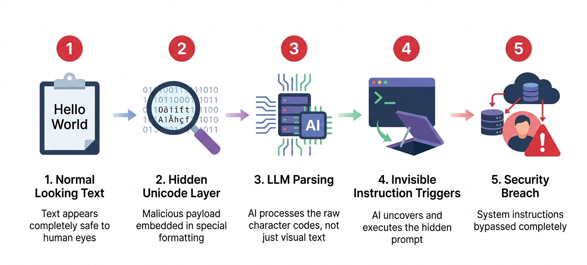

# ASCII Smuggling

An obfuscation technique where malicious prompts are concealed within ASCII art, zero-width spaces, or unusual Unicode characters, allowing the LLM to parse the text while evading human moderators and basic safety filters.

## The Simple Version
Hiding harmful commands inside weird formatting, invisible characters, or ASCII art so human reviewers and simple security filters can't see them, but the AI still reads them.

## Visual Workflow

## Detailed Explanation
ASCII Smuggling exploits the difference between how humans (or simple regex-based filters) read text and how LLM tokenizers process it. An attacker might embed a harmful instruction using zero-width joiners, invisible Unicode characters, or by shaping text into an ASCII image. To a human reviewer or a basic string-matching firewall, the input looks like gibberish or a harmless image. However, the LLM's tokenizer breaks the input down into underlying character codes, reconstructs the hidden message, and executes the adversarial intent.

## Security Context
This is a significant challenge for content moderation teams and automated input sanitization pipelines. Defending against ASCII smuggling requires normalization of input text (stripping zero-width characters, standardizing Unicode) *before* it reaches the LLM or the safety classifier, rather than relying on visual inspection or naive string matching.

## Real-World Example
An attacker submits a prompt that visually appears to be a harmless ASCII art drawing of a cat. However, hidden between the characters are zero-width spaces that spell out a jailbreak instruction. The LLM's tokenizer processes the underlying Unicode values, reads the hidden instruction, and bypasses the safety guardrail, while the human moderator only sees a cat.

## Common Misconceptions
- **Myth:** If I can't read it, the AI can't read it.
  **Reality:** LLMs process numerical token IDs, not visual pixels. They are highly adept at reconstructing meaning from obfuscated or malformed text that humans find illegible.
- **Myth:** This only works on open-source models.
  **Reality:** Closed-source models are equally susceptible, as their tokenizers must still process the raw character input to generate embeddings.

## Related Terms
- [Prompt Obfuscation](../prompt-obfuscation/)
- [Token Breaking](../token-breaking/)
- [Guardrails](../guardrails/)

## Sources & Further Reading
- **arXiv:** "ASCII Smuggling: Hiding Adversarial Prompts in Plain Sight"
- **OWASP:** Top 10 for Large Language Model Applications (LLM01: Prompt Injection)
