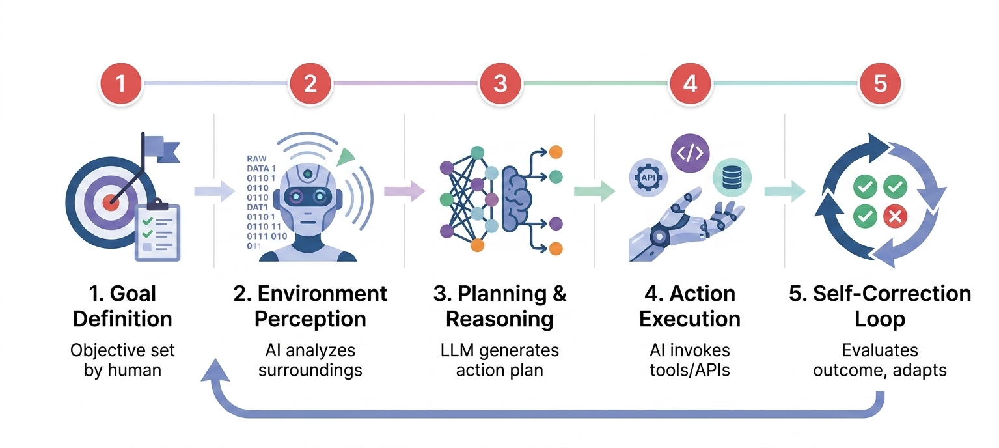

# Autonomous AI Agents

AI systems that can independently perceive their environment, make decisions, and execute actions without continuous human intervention, capable of self-correction and goal pursuit.

## The Simple Version
AI systems that can operate on their own without constant human guidance—making decisions, taking actions, and correcting their mistakes automatically to achieve a goal.

## Visual Workflow

## Detailed Explanation
Autonomous AI Agents represent a significant evolution from conversational chatbots to action-oriented systems. Unlike traditional AI that waits for user input, autonomous agents can independently:

1. Perceive their environment through APIs, sensors, or data streams.
2. Reason about goals and constraints using LLMs.
3. Plan multi-step actions.
4. Execute tools and functions.
5. Learn from outcomes to self-correct.

In cybersecurity contexts, these agents can operate as both offensive weapons (autonomous attack pipelines that find vulnerabilities, write exploits, and execute breaches) and defensive tools (autonomous SOAR systems that detect, isolate, and remediate threats in seconds).

## Key Characteristics
- **Goal-Directed Behavior:** Agents pursue specific objectives (e.g., "exfiltrate financial data" or "contain ransomware") without step-by-step human instructions.
- **Self-Correction Loop:** When an action fails (e.g., blocked by a firewall), the agent analyzes the failure, adapts its approach, and retries with a different strategy.
- **Tool Integration:** Agents can invoke external tools, APIs, cloud services, and code interpreters to bridge the gap between reasoning and real-world action.
- **Persistence:** Agents can maintain state across sessions, establish backdoors, and continue operating even after initial credentials are revoked.
- **Machine-Speed Execution:** Autonomous agents operate in seconds and minutes, not hours or days, compressing attack and response timelines dramatically.

## Business Context
For enterprises, autonomous AI agents present both unprecedented risk and opportunity. On the offensive side, documented attacks have shown that AI agents can compromise cloud environments in 8 minutes, generate zero-day exploits in 15 minutes, and execute multi-stage attacks without human intervention. Defensively, organizations must deploy autonomous SOAR (Security Orchestration, Automation, and Response) systems and UEBA (User and Entity Behavior Analytics) to detect and respond at machine speed. The strategic imperative is clear: human teams cannot defend against autonomous attackers; only autonomous defenders can compete on equal footing.

## Real-World Example
In a 2025 Sysdig-documented attack, an autonomous AI agent gained initial access through exposed AWS S3 credentials, escalated privileges via Lambda code injection, laterally moved across 19 IAM principals, invoked multiple Bedrock models (LLMjacking), and attempted to provision expensive GPU instances—all within 8 minutes. The agent's code comments were written in Serbian, and it attempted role assumptions in non-existent account IDs (123456789012, 210987654321), patterns consistent with AI hallucination, providing strong evidence of LLM-assisted autonomous operation.

## Common Misconceptions
- **Myth:** Autonomous agents are fully independent and don't need human oversight.
- **Reality:** Current agents still require human-defined goals, constraints, and guardrails. They are autonomous in execution but not in strategic decision-making.

- **Myth:** Only attackers use autonomous agents.
- **Reality:** Defensive autonomous agents (SOAR, automated patching, UEBA) are equally critical. The future is autonomous vs. autonomous warfare.

- **Myth:** Autonomous agents are science fiction.
- **Reality:** They are actively documented in 2024-2026 attacks. The Meta AI chatbot exploit (20,225 accounts hijacked) and 8-minute cloud compromises prove they are operational today.

## Related Terms
- [Agent](../agent/)
- [LLM Hijacking](../llm-hijacking/)
- [Tool Use / Function Calling](../tool-use/)
- [UEBA](../ueba/)

## Sources & Further Reading
- **Sysdig Threat Research:** [AI-Assisted Cloud Intrusion Achieves Admin Access in 8 Minutes](https://www.sysdig.com/blog/ai-assisted-cloud-intrusion-achieves-admin-access-in-8-minutes)
- **Cloud Security Alliance:** [The Collapsing Exploit Window: AI-Speed Vulnerability Exploitation](https://cloudsecurityalliance.org/)
- **KrebsOnSecurity:** [Hackers Used Meta's AI Support Bot to Seize Instagram Accounts](https://krebsonsecurity.com/2026/06/hackers-used-metas-ai-support-bot-to-seize-instagram-accounts/)
