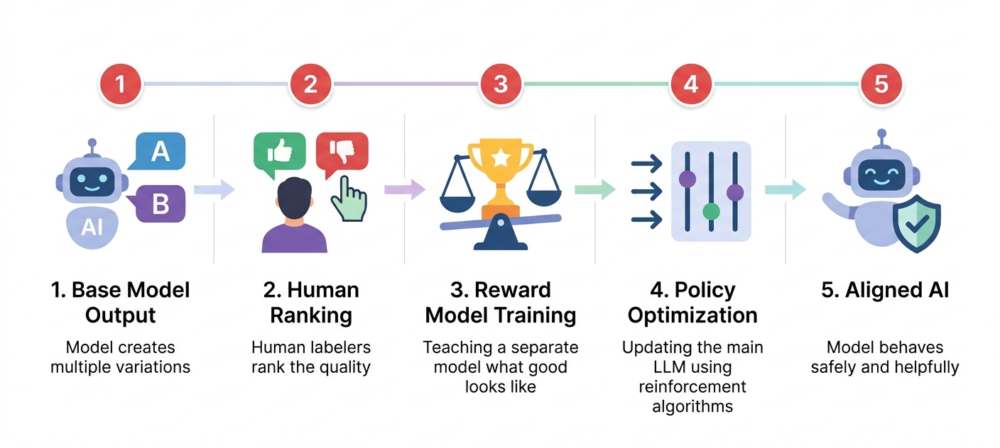

# RLHF (Reinforcement Learning from Human Feedback)

A training technique that aligns AI models with human preferences by using feedback from human raters to guide the model toward generating helpful, harmless, and honest outputs.

## The Simple Version
Imagine you're teaching a puppy to behave well. At first, the puppy doesn't know what you want. But every time it does something good — like sitting when you ask, or not chewing on your shoes — you give it a treat and say "Good dog!" Over time, the puppy learns which behaviors make you happy and does more of those things.

RLHF works the same way with AI. First, the AI generates lots of different responses to questions. Then, human reviewers look at those responses and rate which ones are better — more helpful, more accurate, safer, or more polite. The AI learns from this feedback and starts generating more of the "good" responses and fewer of the "bad" ones.

It's like having a teacher who doesn't just give you the answers, but tells you when you're on the right track. The AI learns what humans value and tries to match those values in its responses.

## Visual Workflow



## Detailed Explanation
RLHF is a three-phase training process that bridges the gap between what a model *can* do (predict text) and what we *want* it to do (be helpful, harmless, and honest).

**Phase 1: Supervised Fine-Tuning (SFT)**
- Start with a pre-trained model
- Fine-tune it on high-quality demonstration data (human-written examples of ideal responses)
- This gives the model a baseline understanding of the task format

**Phase 2: Reward Model Training**
- The SFT model generates multiple responses to the same prompt
- Human raters rank these responses from best to worst
- Train a separate "reward model" to predict human preferences
- The reward model learns to score responses based on alignment with human values

**Phase 3: Reinforcement Learning Optimization**
- Use the reward model as a scoring function
- Apply reinforcement learning (typically PPO - Proximal Policy Optimization) to optimize the language model
- The model learns to generate responses that receive high reward scores
- A KL divergence penalty prevents the model from straying too far from the SFT baseline

**Key components:**
- **Policy Model:** The language model being trained
- **Reward Model:** Learned from human preferences, scores response quality
- **Reference Model:** Frozen SFT model used to prevent excessive drift
- **PPO Algorithm:** Reinforcement learning algorithm that updates the policy

## Key Characteristics
- **Human Alignment:** Directly optimizes for human preferences rather than just next-token prediction
- **Nuanced Understanding:** Can capture subtle qualities like helpfulness, honesty, and harmlessness
- **Iterative Improvement:** Can be repeated with new feedback to continuously improve alignment
- **Scalable Oversight:** Once the reward model is trained, it can evaluate millions of responses without additional human labor
- **Behavioral Control:** Allows fine-grained control over model behavior and output style

## Business Context
RLHF is critical for enterprise AI deployment because it addresses the fundamental challenge of making AI systems safe and useful in real-world applications:

**Why enterprises need RLHF:**
- **Brand Safety:** Prevent embarrassing or harmful outputs that could damage reputation
- **Regulatory Compliance:** Meet requirements for AI safety and responsible deployment
- **User Trust:** Ensure AI behaves predictably and respectfully with customers
- **Quality Control:** Maintain consistent, high-quality outputs across all interactions
- **Risk Mitigation:** Reduce liability from inappropriate or inaccurate AI responses

**Implementation considerations:**
- **Cost:** Human labeling is expensive ($50K-$500K+ depending on scale)
- **Expertise Required:** Need skilled annotators who understand your domain
- **Time:** Full RLHF pipeline takes weeks to months
- **Iteration:** May need multiple rounds of feedback and training
- **Vendor Options:** Many AI providers (OpenAI, Anthropic) offer RLHF-trained models, reducing the need to build from scratch

**When to use RLHF vs. alternatives:**
- **RLHF:** When you need fine-grained control over model behavior and have resources for human labeling
- **Constitutional AI:** When you want alignment with less human labeling (uses AI feedback)
- **Prompt Engineering:** When you need quick, lightweight behavior control
- **Fine-tuning:** When you need domain expertise but not behavioral alignment

## Real-World Analogy
Training a new customer service representative. First, they learn the basics from a training manual (pre-training). Then, they shadow experienced reps and practice with sample scenarios (supervised fine-tuning). Finally, a supervisor listens to their calls and provides feedback on tone, accuracy, and helpfulness (reward model). The rep uses this feedback to improve their approach (reinforcement learning), gradually becoming more aligned with company standards.

## Code Example

```python
# Conceptual RLHF workflow (simplified)
from transformers import AutoModelForCausalLM, AutoTokenizer

# Load the models
tokenizer = AutoTokenizer.from_pretrained("model-name")
policy_model = AutoModelForCausalLM.from_pretrained("model-name")
reward_model = AutoModelForCausalLM.from_pretrained("reward-model")

# Step 1: Generate multiple responses to the same prompt
prompt = "What are the benefits of exercise?"
inputs = tokenizer(prompt, return_tensors="pt")

# Generate 4 different responses
responses = []
for i in range(4):
    output = policy_model.generate(
        **inputs,
        max_new_tokens=50,
        do_sample=True,
        temperature=0.8
    )
    response = tokenizer.decode(output[0], skip_special_tokens=True)
    responses.append(response)

# Step 2: Human raters rank the responses (done offline)
# Response 3 > Response 1 > Response 4 > Response 2

# Step 3: Train reward model on human rankings
# (This happens once, offline)
# reward_model learns to predict human preferences

# Step 4: Use reward model to score new responses
for response in responses:
    scored_input = tokenizer(prompt + response, return_tensors="pt")
    score = reward_model(**scored_input).logits[0, -1].item()
    print("Score:", score, "-", response[:50])

# Step 5: Reinforcement learning (PPO)
# - Update policy_model to generate responses that score higher
# - Add KL penalty to keep policy_model close to original
# - Repeat across many prompts
```

## Common Misconceptions
- **Myth:** RLHF makes AI "understand" human values.
- **Reality:** RLHF optimizes for patterns in human preferences as captured by the reward model. The model doesn't truly understand values — it learns statistical patterns that correlate with high reward scores.

- **Myth:** RLHF is a one-time process.
- **Reality:** Alignment is ongoing. As use cases evolve and new edge cases emerge, RLHF may need to be repeated with updated feedback to maintain alignment.

- **Myth:** RLHF completely eliminates harmful outputs.
- **Reality:** RLHF significantly reduces harmful outputs but cannot guarantee 100% safety. Adversarial inputs can still elicit problematic responses. Multiple layers of safety (RLHF + filtering + monitoring) are needed.

## Related Terms
- [AI Sycophancy](../ai-sycophancy/)
- [Alignment](../alignment/)
- [Constitutional AI](../constitutional-ai/)
- [Digital Labor](../digital-labor/)
- [Fine-tuning](../fine-tuning/)
- [Reward Model](../reward-model/)

## Sources & Further Reading
- [Training language models to follow instructions with human feedback (InstructGPT Paper)](https://arxiv.org/abs/2203.02155)
- [Anthropic's Constitutional AI](https://www.anthropic.com/index/constitutional-ai-harmlessness-from-ai-feedback)
- [OpenAI's Approach to Alignment](https://openai.com/research#alignment)
- [DeepRLHF: A Survey of Reinforcement Learning from Human Feedback](https://arxiv.org/abs/2307.03578)
