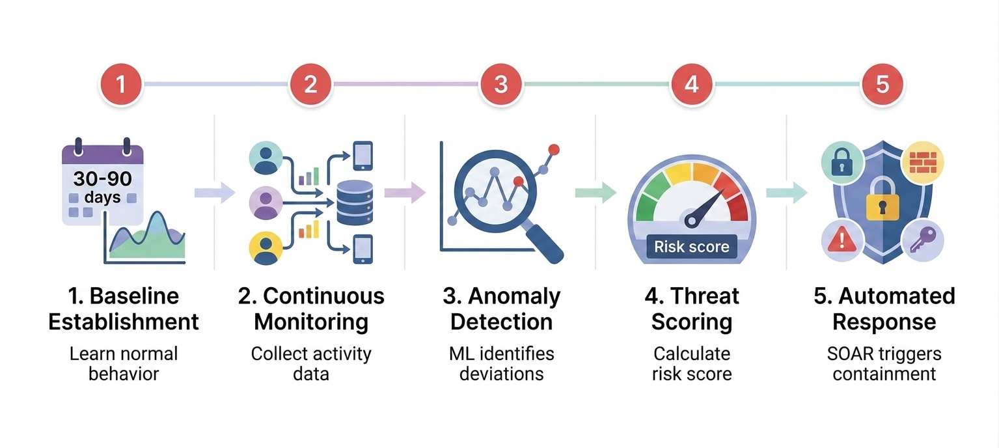

# UEBA (User and Entity Behavior Analytics)

AI-powered security technology that establishes behavioral baselines for users, devices, and systems, then uses machine learning to detect anomalies that indicate threats, insider risks, or compromised accounts.

## The Simple Version
AI that learns what "normal" behavior looks like for every user and system in your network, then instantly flags anything unusual—like a service account accessing sensitive data at 3 AM or an employee downloading gigabytes of files they've never touched before.

## Visual Workflow

## Detailed Explanation
UEBA (User and Entity Behavior Analytics) represents a paradigm shift from signature-based detection to behavior-based detection. Traditional security tools look for known malicious patterns (signatures), but UEBA uses machine learning to establish dynamic baselines of normal activity for each user, device, service account, and application. It then continuously monitors for deviations that indicate potential threats. UEBA analyzes hundreds of features including: (1) **Temporal Patterns**—login times, session durations, activity frequency; (2) **Geographic Patterns**—login locations, network paths, impossible travel; (3) **Resource Access Patterns**—files accessed, APIs called, databases queried; (4) **Data Movement Patterns**—volume of data transferred, destinations, protocols; and (5) **Privilege Usage Patterns**—role assumptions, permission escalations, administrative actions. When anomalies exceed thresholds, UEBA triggers alerts or automated responses via SOAR integration.

## Key Characteristics
- **Baseline Learning:** UEBA systems require a learning period (typically 30-90 days) to establish normal behavioral profiles for each entity.
- **Multi-Model Detection:** Modern UEBA employs multiple ML algorithms: **Isolation Forest** for general anomaly detection, **Graph Neural Networks (GNN)** for lateral movement detection, and **LSTM (Long Short-Term Memory)** for time-series analysis of data exfiltration patterns.
- **Entity-Centric:** Unlike traditional SIEM that focuses on events, UEBA focuses on entities (users, devices, accounts) and their behavioral trajectories over time.
- **Context-Aware:** UEBA distinguishes between benign anomalies (employee working late on a project) and malicious anomalies (service account querying IAM roles at 3 AM from a foreign IP).
- **Automated Response Integration:** UEBA platforms integrate with SOAR to trigger automated containment (isolate host, revoke credentials, block IP) when high-confidence threats are detected.

## Business Context
For enterprises facing AI-powered threats, UEBA is a critical defense pillar. Autonomous AI agents operate at machine speed and can compromise environments in 8 minutes—far faster than human analysts can respond. UEBA provides the detection speed and behavioral intelligence needed to identify: (1) **Compromised Accounts**—sudden changes in user behavior indicating account takeover; (2) **Insider Threats**—employees or contractors exfiltrating data before resignation; (3) **AI-Driven Attacks**—autonomous agents exhibiting non-human patterns (e.g., rapid role assumption, unusual API call sequences); and (4) **Lateral Movement**—attackers pivoting across systems after initial compromise. UEBA is essential for SOC 2 Type II, PCI-DSS, and HIPAA compliance, demonstrating continuous monitoring and threat detection capabilities.

## Real-World Example
In the 2025 Sysdig 8-minute cloud compromise, UEBA would have detected multiple critical anomalies: (1) **Service Account Anomaly:** `test-automation-user` enumerating 10+ AWS services and invoking Lambda `UpdateFunctionCode` at unusual frequency; (2) **Impossible Privilege Escalation:** Lambda function creating access keys for user `frick` (an action outside its normal scope); (3) **Rapid Role Assumption:** 6 IAM roles assumed across 14 sessions in under 2 hours; (4) **Bedrock Abuse:** 13 invocations of 9 different AI models in 53 minutes; and (5) **GPU Provisioning Attempt:** Creation of `p4d.24xlarge` instance ($32.77/hour) with publicly accessible JupyterLab server. Each of these behaviors would trigger UEBA alerts within seconds of occurrence.

## Common Misconceptions
- **Myth:** UEBA is just advanced log analysis.
  **Reality:** UEBA uses machine learning to detect behavioral patterns that are invisible to rule-based log analysis. It learns what's normal rather than relying on predefined rules.
- **Myth:** UEBA produces too many false positives.
  **Reality:** Modern UEBA platforms use ensemble ML models and context-aware scoring to achieve <5% false positive rates. The key is proper baseline tuning and threshold calibration.
- **Myth:** UEBA is only for detecting insider threats.
  **Reality:** While excellent for insider threat detection, UEBA is equally powerful for detecting external threats, compromised accounts, AI-driven attacks, and lateral movement.

## Related Terms
- [Autonomous AI Agents](../autonomous-ai-agents/)
- [SOAR](../soar/)
- [Observability](../observability/)
- [AI Gateway](../ai-gateway/)

## Sources & Further Reading
- **Gartner:** [Market Guide for User and Entity Behavior Analytics](https://www.gartner.com/)
- **Vectra AI:** [AI-Native Threat Detection with UEBA](https://www.vectra.ai/)
- **Microsoft:** [UEBA in Microsoft Sentinel](https://learn.microsoft.com/en-us/azure/sentinel/)
- **Sysdig:** [Detecting AI-Assisted Cloud Intrusions with Behavioral Analytics](https://www.sysdig.com/blog/ai-assisted-cloud-intrusion-achieves-admin-access-in-8-minutes)
